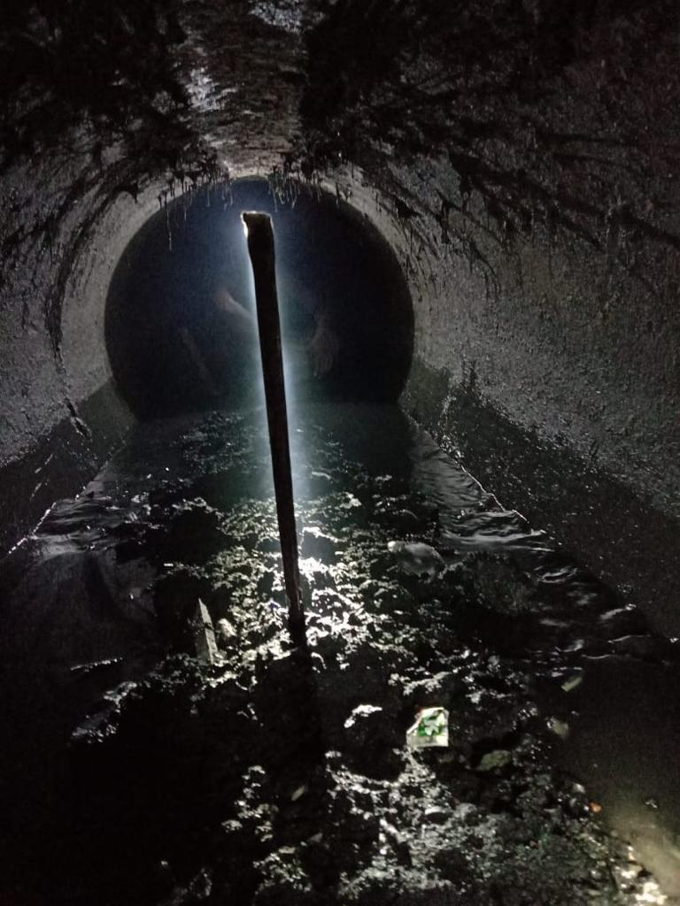
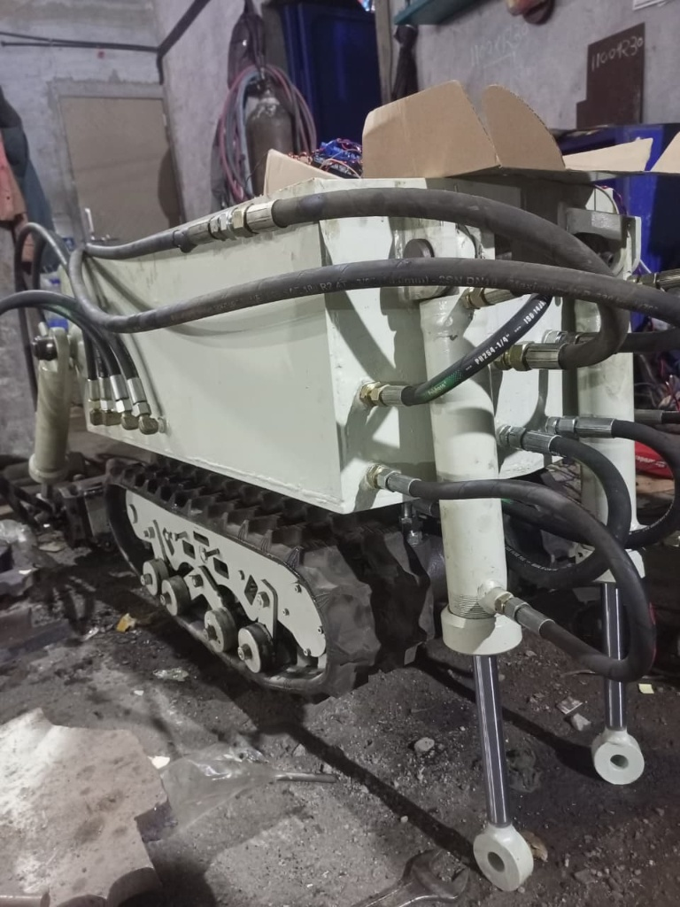
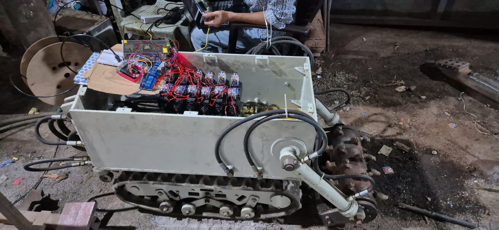

While working at Aavantrex Industries Pvt. Ltd., I was involved in the development of a sewer-cleaning robotic system, where my responsibilities focused on electronics integration and control algorithms. This project marked a significant shift from my prior experience with electric motor control, as I was now working with hydraulic motors and fluid-based actuation systems. The robot used hydraulic motors driven through Janatics electro-hydraulic actuators, where motor speed and torque were controlled by regulating hydraulic flow via proportional hydraulic control valves. By varying valve opening, I was able to control the effective flow rate and, in turn, the RPM and motion profile of the hydraulic motors, requiring a different control mindset compared to voltage- or PWM-based electric motor control.

The control architecture was built around a Raspberry Pi 5, which interfaced with the hydraulic actuators and valves, generating command signals based on high-level motion inputs. Communication between the onboard controller and the main control panel was implemented using Ethernet, providing a reliable and high-bandwidth link suitable for industrial environments. The control panel itself was also powered by a Raspberry Pi with an attached display, enabling real-time monitoring and operator interaction. For visual feedback, I implemented MJPEG streaming, allowing live camera feeds from the robot to be transmitted over the network to the control panel. MJPEG streaming was chosen for its low latency and simplicity, as it streams a sequence of JPEG images over HTTP, making it well-suited for real-time supervision and debugging without requiring heavy decoding pipelines.

In addition to vision-based feedback, I implemented a sonar-based sensing system to scan the surrounding environment inside sewer pipes. Sonar data was processed and visualized to provide operators with a clear representation of nearby obstacles and open areas, improving situational awareness in low-visibility conditions. Through this project, I gained hands-on experience with hydraulic actuation, industrial communication protocols, real-time control integration, and sensor-based visualization, expanding my skill set beyond traditional electric motor control and strengthening my ability to work across electromechanical, fluid, and software domains.

Source: <a href="https://github.com/theVacay/vacay"><i class="large github icon"></i>theVacay/vacay</a>
