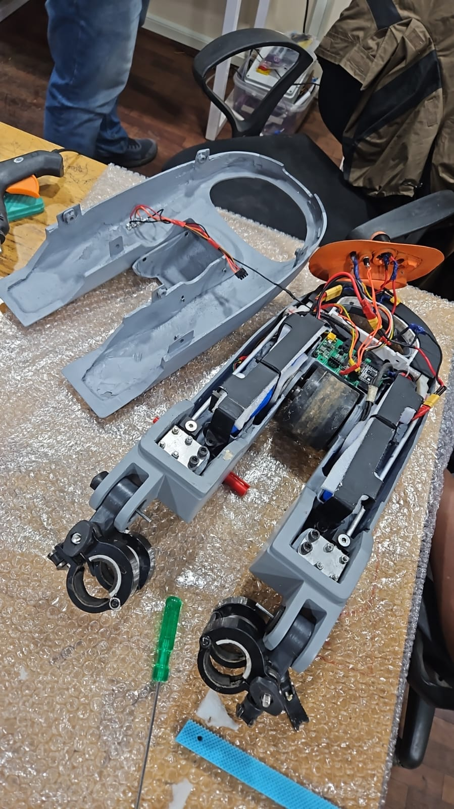
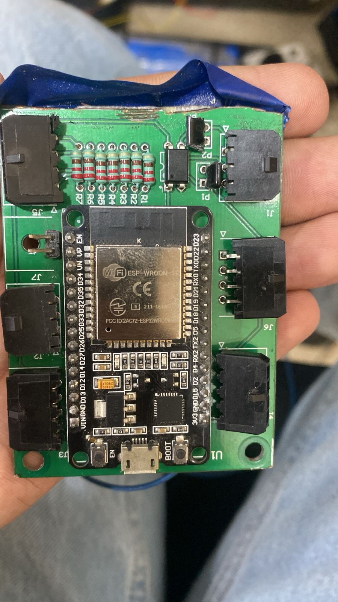
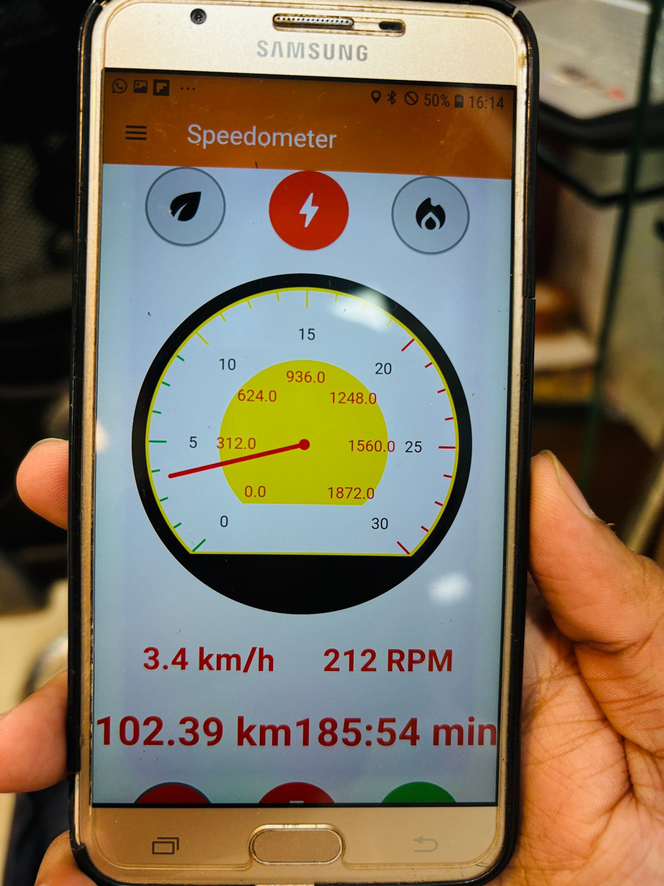

  
  
  
  

While at Hook EV Systems, I was tasked with the design and implementation of the core embedded electronics for the EV bicycle conversion kit, with a focus on compactness, connectivity, and secure access. The system’s purpose was to enable any conventional bicycle to be converted into an electric bicycle with real-time data connectivity and intuitive mode selection.

I architected and developed a custom ESP32-based control PCB that formed the backbone of the conversion kit’s electronics. This controller interfaced with the custom 4-layer ESC to capture motion feedback and manage BLDC motor activation. I also implemented three distinct riding modes—Assist, Stroll, and Sport—using a PPM-guided control strategy where motor RPM changed dynamically based on mode selection, improving adaptability and rider experience.
To support secure interaction with the vehicle and kiosk infrastructure, I integrated a PN532 NFC/RFID reader module for tag-based authentication, enabling user access control at docking stations and service points. The NFC solution was responsible for reliable tag detection and secure identity verification.
For kiosk location tracking and backend telemetry, I integrated a SIM808 GSM/GPRS/GPS module with an external GPS antenna to provide real-time geographic coordinates to the backend system, enabling accurate kiosk positioning and operational monitoring. The SIM808 module supports quad-band GSM communication and integrated GNSS positioning with sub-3-meter accuracy, facilitating robust vehicle and kiosk tracking solutions.

Battery management status was communicated to users and technicians via an onboard LED indicator, providing instantaneous visibility of system charge levels.
While the overall conversion kit and kiosk ecosystem were collaborative efforts, my primary contributions were in embedded control PCB design, wireless integration for NFC access, and GPS-based kiosk tracking—all critical to the product’s operational and user experience features.

